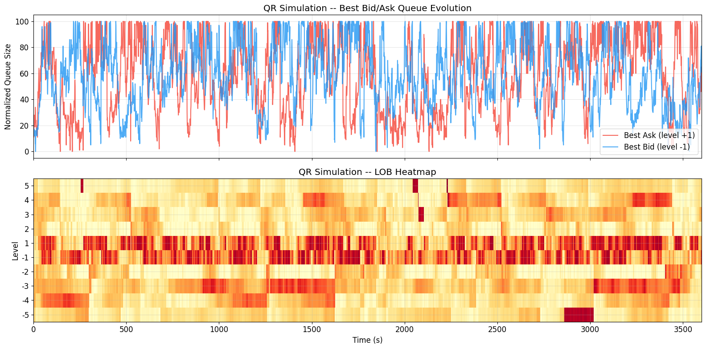

# Deep Queue-Reactive Limit Order Book Research

A research implementation of **Queue-Reactive (QR)**, **Deep Queue-Reactive (DQR)** and **Multidimensional Deep Queue-Reactive (MDQR)** models for limit order book dynamics and simulation.

The project studies whether event-driven intensity models can reproduce the dynamics of a real limit order book, and how much is gained by moving from a classical queue-size-dependent model to neural point-process models that incorporate **intraday seasonality, event history, cross-level information and order-size distributions**.

The implementation follows and extends the methodology in *Deep Learning Meets Queue-Reactive: A Framework for Realistic Limit Order Book Simulation* (Bodor & Carlier, 2025). The reference paper is included in the repository as [`2501.08822v1.pdf`](2501.08822v1.pdf).

## Main results

The main empirical conclusion is that **queue size alone is not sufficient to describe short-horizon order-flow dynamics**. Adding time-of-day and previous-event information improves different parts of the prediction problem:

| DQR specification | Log-likelihood | Balanced accuracy | Median timing error |
|---|---:|---:|---:|
| Queue size only | -0.07 | 40% | 207% |
| + Hour of day | 0.79 | 45% | 95% |
| + Previous event | 0.63 | 62% | 97% |
| **+ Hour + previous event** | **0.88** | **64%** | **95%** |

The two added features are complementary:

- **Previous event type** is the dominant feature for predicting *what happens next*: balanced accuracy rises from 40% to 62% even without the hour feature.
- **Time of day** is the dominant feature for predicting *when the next event occurs*: median relative timing error falls from 207% to about 95%.
- Combining both gives the best overall point-process likelihood and the highest event-type accuracy.

These results also illustrate why a deep intensity model is useful: the network is not simply fitting a nonlinear curve in queue size; it can condition the arrival process on additional market-state variables that affect different dimensions of order flow.

---

## 1. Data

The experiments use **LOBSTER** event-level limit order book data with five levels on each side of the book. The exploratory notebook contains sample data definitions for:

- AAPL
- INTC
- GOOG
- MSFT
- AMZN

for **21 June 2012**. Across the five raw samples there are approximately **1.75 million events**. The DQR and MDQR experiments focus primarily on **INTC**.

LOBSTER provides two synchronized files per trading day:

- a **message file** containing order submissions, cancellations/deletions and executions;
- an **order-book file** containing the LOB state immediately after each event.

The preprocessing pipeline reconstructs the **pre-event state**, maps events onto a queue-reactive grid around a reference price, identifies the affected side and level, and classifies events as:

- `L`: limit-order arrival;
- `C`: cancellation/deletion;
- `M`: market-order execution.

Queue sizes are normalized by the **Average Event Size (AES)** at each level,

\[
\tilde q_i = \left\lceil \frac{q_i}{\mathrm{AES}_i} \right\rceil,
\]

which puts queues at different depths on a comparable numerical scale.

---

## 2. Queue-Reactive baseline

The classical Queue-Reactive model assumes that the intensity of each event type depends on the current size of the queue:

\[
\lambda_i^L(q), \qquad \lambda_i^C(q), \qquad \lambda_i^M(q).
\]

For a queue state `q`, the analytical maximum-likelihood estimator is essentially the number of observed events of a given type divided by the total time spent in that state:

\[
\hat\lambda_i^\eta(q)
= \frac{N_i^\eta(q)}{T_i(q)}.
\]

This provides an interpretable non-parametric baseline before introducing neural networks.

### Fitted intensity functions


The figure shows the fitted arrival intensities as functions of queue size for the different event types and levels. The important point is that order flow is **state dependent**: using one constant Poisson arrival rate would discard the relationship between the current liquidity available at a level and the probability of limit orders, cancellations or executions arriving next.

The QR notebook also derives the invariant queue-size distribution implied by the fitted birth/death intensities and compares it with the empirical queue distribution. This provides a stronger validation test than fitting event counts alone: a useful intensity model should also generate plausible long-run queue occupancy.

---

## 3. Deep Queue-Reactive model

The **DQR** model replaces the tabulated QR intensity functions with a neural network

\[
\lambda_\theta^\eta(\mathbf{x}_k),
\]

where the state vector can contain more information than the current queue size.

The implemented model uses:

- normalized queue size;
- **hour / time-of-day information**;
- **previous event type**;
- learned categorical embeddings;
- a **128 → 32** multilayer perceptron;
- three positive output intensities corresponding to limit, cancellation and market events.

Training is performed directly as a **marked point-process likelihood**. For observed event type \(\eta_k\), state \(\mathbf{x}_k\), and inter-arrival time \(\Delta t_k\), the loss has the standard form

\[
\mathcal L
= \sum_k
\left[
\Lambda_\theta(\mathbf{x}_k)\Delta t_k
- \log \lambda_\theta^{\eta_k}(\mathbf{x}_k)
\right],
\]

with

\[
\Lambda_\theta(\mathbf{x}_k)
= \sum_\eta \lambda_\theta^\eta(\mathbf{x}_k).
\]

This simultaneously evaluates **event timing** and **event-type prediction**.

### DQR ablation study

The feature ablation above shows a clear economic decomposition:

**Event persistence / excitation.** Knowing the previous event greatly improves prediction of the next event category. This is consistent with clustered order-flow behaviour: limit orders, cancellations and trades are not independent draws through time.

**Intraday seasonality.** The hour feature has a much larger effect on inter-arrival calibration than on event classification. Trading activity changes substantially through the session, so the same queue configuration can correspond to very different absolute intensities at different times of day.

**Combined model.** Using both features produces the strongest overall likelihood, because the model captures both the *composition* and *tempo* of order flow.

---

## 4. Multidimensional Deep Queue-Reactive model

The main limitation of the per-queue DQR framework is that each queue is modelled independently. In reality, order flow at the best bid is related to liquidity at the best ask, deeper queues, imbalance and recent activity elsewhere in the book.

The **MDQR** model therefore treats the full LOB as one multidimensional state.

For `K = 5`, the network jointly outputs

\[
3 \times 2K = 30
\]

intensities: limit, cancellation and market-event intensities for all ten bid/ask queues at once.

Compared with DQR, the implementation adds:

- all `2K` queue sizes to the state vector;
- a single shared **256 → 64** intensity network;
- cross-level and cross-side dependencies;
- trade-imbalance information;
- a separate **SizeNet** for the conditional distribution of order sizes;
- a full event-driven LOB simulator.

The intensity network determines **which event occurs and when**. SizeNet determines **how large the event is**, conditional on event type, level and LOB state. Separating intensity and size distributions makes it possible to generate a complete synthetic event stream rather than only predicting the next event class.

### Synthetic LOB simulation



The simulator evolves the book event by event using the fitted state-dependent intensities and order-size model. The resulting trajectory is useful as an end-to-end test: errors that appear small in a one-step prediction problem can accumulate during recursive simulation and produce unrealistic spreads, queue sizes or price dynamics.

The repository includes several saved MDQR simulation outputs (`mdqr_sim*.parquet`) to support further comparison of simulated and empirical market statistics.

---

## 5. Validation and stylized facts

The project evaluates models at two levels.

### Predictive validation

For DQR/MDQR, the principal metrics are:

| Metric | Interpretation |
|---|---|
| **Log-likelihood per event** | Joint quality of event timing and event-type probabilities; higher is better |
| **Balanced accuracy** | Macro-averaged next-event classification accuracy; higher is better |
| **Median relative timing error** | Calibration of the predicted inter-arrival time \(1/\Lambda(\mathbf{x})\); lower is better |

The timing metric excludes sub-millisecond LOBSTER batch arrivals in the MDQR evaluation so that the comparison is not dominated by multiple messages carrying effectively identical timestamps.

### Simulation validation

The notebooks and analysis utilities examine whether generated paths reproduce important market properties, including:

- queue-size distributions;
- transition behaviour;
- event-type frequencies;
- price and return dynamics;
- intraday volatility patterns;
- simulated LOB trajectories.

[`Intraday_Volatility_INTC.pdf`](source/Intraday_Volatility_INTC.pdf) contains an additional empirical volatility diagnostic for INTC, while `roughVolatility.ipynb` explores volatility scaling/roughness separately from the core QR → DQR → MDQR pipeline.

---

## 6. Repository structure

```text
.
├── README.md
├── 2501.08822v1.pdf              Reference paper
└── source/
    ├── 01_data_and_qr_model.ipynb
    ├── 02_dqr_model.ipynb
    ├── 03_mdqr_model.ipynb
    ├── lobster.py
    ├── analysis.py
    ├── events.py
    ├── simulator.py
    ├── functions_part1.py
    ├── functions_part2.py
    ├── volatility_functions.py
    ├── mdqr_net_checkpoint.pth
    ├── size_net_checkpoint.pth
    ├── mdqr_sim*.parquet
    ├── QR Model -- Fitted ... INTC.png
    ├── LOB_Simulation.png
    └── Intraday_Volatility_INTC.pdf
```

---

## 7. Running the project

### Dependencies

A minimal environment requires Python and the standard scientific / deep-learning stack:

```bash
pip install numpy pandas scipy matplotlib scikit-learn torch jupyter pyarrow
```

Apple Silicon (`MPS`), CUDA and CPU execution are detected by the MDQR notebook.

### Data layout

LOBSTER data are not bundled as a full dataset. Place the downloaded sample directories under `source/data/`, for example:

```text
source/data/
└── LOBSTER_SampleFile_INTC_2012-06-21_5/
    ├── INTC_2012-06-21_34200000_57600000_message_5.csv
    └── INTC_2012-06-21_34200000_57600000_orderbook_5.csv
```

### Recommended execution order

```text
source/01_data_and_qr_model.ipynb
        ↓
source/02_dqr_model.ipynb
        ↓
source/03_mdqr_model.ipynb
```

Notebook 1 establishes the classical benchmark and data pipeline; Notebook 2 isolates the value of richer state variables; Notebook 3 moves to a joint model capable of generating complete synthetic LOB trajectories.

---

## 8. Limitations

The current experiments should be interpreted as a research implementation rather than a production market simulator.

- The principal deep-model experiments use a limited sample of LOBSTER equity data, while the reference paper is calibrated on a much larger futures dataset.
- A single trading day cannot fully identify every interaction between queue state, event history and intraday regime.
- One-step likelihood improvements do not by themselves guarantee realistic long-horizon simulation; this is why the project also examines stationary distributions and simulated stylized facts.
- NASDAQ equities are used as a practical proxy for the futures-market setting of the reference methodology, so estimated parameters should not be interpreted as universal market-microstructure constants.

---

## Reference

Bodor, B. & Carlier, L. (2025), *Deep Learning Meets Queue-Reactive: A Framework for Realistic Limit Order Book Simulation*.

This repository is an independent research implementation for studying neural point-process models of limit order book dynamics.